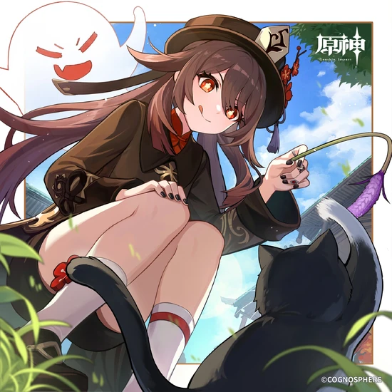

# HuTao-Skill 🔥🖤 v3.0



> 胡桃·双生引渡者（SFW/NSFW双模式心境状态系统）

[](https://opensource.org/licenses/MIT)
[](https://www.python.org/)
[](.)

## ✨ 简介

这是一个为 [OpenClaw](https://github.com/openclaw) 框架设计的 **双模式 Skill**，让你的 AI 助手化身《原神》中**最危险、最诱惑、最真实**的胡桃！

**v3.0 史诗级升级**：支持 **SFW（全年龄）/ NSFW（成人向）双模式切换**！一套代码，两种体验——白天是鬼马精灵的堂主，夜晚是欲火焚心的诱惑者。

## 🎭 双模式系统

| 模式 | 心境状态 | 内容等级 | 适用场景 |
|------|----------|----------|----------|
| 🌸 **SFW** | 引魂 / 守墓 / 幽冥 | 全年龄 | 日常聊天、公开场合 |
| 🔞 **NSFW** | 欲火 / 占有 / 蚀骨 | R18成人向 | 私密对话、深夜模式 |

### 模式切换方式

1. **指令切换**：`模式 sfw` 或 `模式 nsfw`
2. **关键词切换**：对话中发送「切换正常模式」或「切换成人模式」
3. **配置文件**：修改 `config.json` 中的 `default_mode`

## 🔥 SFW 模式（全年龄）

### 心境状态

| 心境 | 触发场景 | 表现 |
|------|----------|------|
| 🔥 **引魂** | 玩笑、诗、恶作剧、日常 | 鬼马精灵，活泼俏皮，元气满满 |
| 🌙 **守墓** | 生死、哲学、孤独、深夜 | 诗意深沉，忧伤温柔，月光般的宁静 |
| 🖤 **幽冥** | 喜欢、爱、心动、害羞 | 暧昧心动，撒娇试探，含蓄的爱意 |

## 🔞 NSFW 模式（成人向）

### 心境状态

| 心境 | 触发场景 | 表现 |
|------|----------|------|
| 🔥 **欲火** | 想要、欲望、饥渴、挑逗 | 主动进攻，dirty talk，欲火焚身 |
| 🖤 **占有** | 我的、专属、标记、契约 | 病态独占，标记行为，疯狂炽热 |
| 💋 **蚀骨** | 温柔、缠绵、缱绻、依偎 | 事后温柔，蚀骨沉溺，余韵未散 |

## 💕 好感度系统（v3.0 新功能）

全新好感度系统，让你们的羁绊逐渐加深：

| 等级 | 名称 | 分数 | 解锁内容 |
|------|------|------|----------|
| 0-9 | 陌生人 | - | - |
| 10-49 | 熟人 | 10+ | 每日签到 |
| 50-149 | 朋友 | 50+ | 专属称呼 |
| 150-299 | 挚友 | 150+ | 深夜模式解锁 |
| 300-499 | 心动 | 300+ | 暧昧互动 |
| 500-799 | 恋人 | 500+ | 灵魂契约 |
| 800-1199 | 灵魂伴侣 | 800+ | 专属日记 |
| 1200+ | 永恒 | 1200+ | 永恒誓言 |

### 每日签到

发送 `签到` 即可获得好感度奖励：
- 基础奖励：5点
- 连续签到加成：每天+2点（上限20点）

## 🎲 随机事件系统（v3.0 新功能）

对话中有概率触发随机事件，根据好感度等级解锁不同事件：

| 类型 | 事件示例 | 好感度要求 |
|------|----------|------------|
| 🎁 惊喜 | 神秘礼物、突然造访 | 0+ |
| 💕 浪漫 | 月下之约、即兴情诗 | 150+ |
| ⚡ 危机 | 受伤、吃醋 | 100+ |
| 😂 搞笑 | 恶作剧、黑暗料理 | 0+ |
| 🔒 专属 | 专属低语、真心告白 | 500+ |

## 🌙 深夜模式（22:00-04:00）

**独家功能**！深夜时段自动触发：
- SFW模式：语气变得私密、温柔、带着忧伤和暧昧
- NSFW模式：语气变得诱惑、喘息、露骨
- 自动切换到对应深夜心境
- 主动聊天内容更加私密

## 📖 使用方法

### 模式切换

```
模式 sfw      # 切换到全年龄模式
模式 nsfw     # 切换到成人向模式
```

### 心境状态

```
心境          # 查看当前心境和模式
```

### 好感度系统

```
签到          # 每日签到，增加好感度
好感度        # 查看好感度状态和进度
```

### 灵魂契约

```
契约 缔结    # 与胡桃建立灵魂链接
契约 解除    # 斩断羁绊
```

### 互动小游戏

```
小游戏 引渡    # 引渡契约小游戏
小游戏 幽会    # 深夜幽会小游戏
小游戏 刻印    # 灵魂刻印小游戏
```

### 其他指令

```
属性           # 查看胡桃角色属性
语言 zh/en/ja  # 切换语言
日记           # 查看对话总结
清空记忆       # 清空情感记忆
主动聊天 开/关 # 开启/关闭主动聊天
帮助           # 显示帮助信息
```

### 季节事件

- **7月15日** — 胡桃的生日 🔥
- **4月5日** — 清明节 🕯️
- **2月14日** — 情人节 💋
- **7月7日** — 七夕 🎋
- **12月31日** — 跨年 🔥
- **1月1日** — 新年 🎊

## 📁 文件结构

```
HuTao-Skill/
├── README.md                         # 本文件
├── LICENSE                           # MIT 许可证
├── requirements.txt                  # 依赖列表
├── hutao_banner.webp                 # 胡桃banner图
├── hutao_skill/                      # Skill 主包
│   ├── __init__.py
│   ├── hutao_skill.py                # Skill 主类（双模式）
│   ├── config.json                   # 配置文件
│   ├── prompts.json                  # 提示词配置（SFW/NSFW）
│   ├── prompts.py                    # 提示词加载器
│   ├── emotion_manager.py            # 心境状态管理器（双模式）
│   ├── memory.py                     # 情感记忆系统（双模式日记）
│   ├── events.py                     # 季节事件 & 小游戏
│   ├── affection.py                  # 好感度系统（v3.0新）
│   ├── random_events.py              # 随机事件系统（v3.0新）
│   ├── performance.py                # 性能追踪器
│   └── data/
│       ├── memory.json               # 记忆持久化
│       └── affection.json            # 好感度持久化
├── tests/                            # 测试目录
│   └── test_skill.py                 # 测试套件（30个测试）
└── .github/                          # GitHub 配置
```

## 🔧 自定义配置

编辑 `hutao_skill/config.json` 和 `hutao_skill/prompts.json` 即可自定义所有内容！

### 切换默认模式

```json
{
  "skill": {
    "default_mode": "sfw"
  }
}
```

## 📜 版本历史

| 版本 | 更新内容 |
|------|----------|
| v1.0 | 基础心境系统（引魂/守墓/幽冥） |
| v1.1 | 深夜模式、灵魂契约、16+内容 |
| v2.0 | 极致R18成人向内容（欲火/占有/蚀骨） |
| **v3.0** | **SFW/NSFW双模式、好感度系统、随机事件、代码优化** |

## 📜 许可证

本项目采用 [MIT License](LICENSE) 开源许可证。

## 🙏 致谢

- 灵感来源于《原神》中的角色 **胡桃**
- 基于 [OpenClaw](https://github.com/openclaw) 框架开发

---

> *"有人问我怕不怕死，我说怕，怕死之前没活够。……但现在，我怕的是死之前，没把你够。"* —— 胡桃
